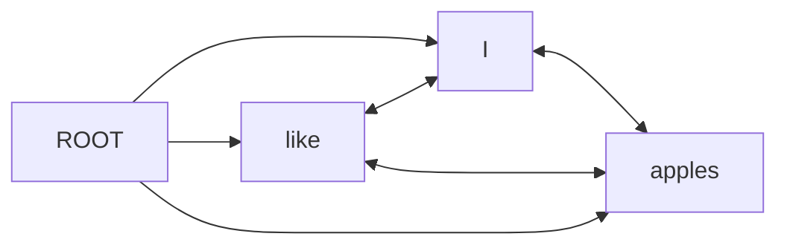

期中考试，人已死

<!-- more -->

# A1 语言结构和语法

Linguistic structure and grammars (Linguistic structure, representation levels, grammars, parsing task, generation task, relation to NLP pipelines)

## 语言结构

### 表示层次

phonological 也就是类似于字母表，音素音标的最小单元，通常本身没有意义

随后它们可以构成 morphological，也就是词根，词缀，词尾等，这些构成了词，是有意义的最小单位

词可以构成句子，这就是 syntactic，但是光满足语法要求不能说明句子有意义

所以我们有 semantic，去解释句子的意义和指代的对象等

### 语法

grammar 指导你如何构建句子，如何解析句子

同时也包括 phonological，也就是发音的规则，声调，哪些音可以拼在一起等

当然也包括 morphological，比如进行时过去时之类的

## 解析任务

基本上来说就是判断一个句子是否符合语法规则

然后再分析它们的结构，找出句子表达的意义

## 生成任务

有两种，一种是很傻的无条件生成，也就是不管句子是否有意义，直接按语法规则生成

另一种是有条件生成，生成满足一定需求的句子，也就是有意义的句子

## 与 NLP 管道的关系

在那时我们还没有 transformer 和端到端模型，所以我们需要一步一步的去拆解和分析句子

也就是我们在管道中执行人为设计的算法，帮助计算机理解句子

# A2 传统 NLP 管道中的元素和任务

Elements and tasks in the traditional NLP pipeline (Structure/order of the pipeline, tokenization, sentence splitting, morphology, POS tagging, syntactic parsing, NER, coreference resolution, entity linking, WSD, semantic role labeling, semantic parsing)

## 管道的结构/顺序

实际上 PPT 中有一个重要的内容没有提到，那就是管道的第一步：预处理

预处理基本就是删除特殊字符，然后统一大小写，去除停用词 the a an 等

随后遵循以下步骤：

先分词，然后拆句子，标词性（POS），解析句法，找命名实体，合并相同指代，链接实体，消除歧义，标语义角色，最后解析语义

## 分词

简而言之就是将句子拆成一个个词，具体怎么拆看需求，同时还可以有规范化的过程

对于如何处理缩写，数字，特殊表达，还有多个词组成的词等，都有不同的处理方式

更进一步的细节看下面专门的章节

## 句子切分

有的时候我们的输入是一大段话，所以我们需要将其拆成一个个句子

这个过程也不是那么简单，比如句号后面的 Mr. Mrs. Dr. 等不应该拆开

## 形态学分析

其实也就是把词再拆开，比如动词的时态，名词的复数等

我们可以通过这个方式确定一个词的格式是否正确

然后我们就能进行时态标注一类的任务了

stem 通常不完整，而 lemma 是完整的，比如 produc 和 produce

## 词性标注

Part-of-speech tagging，简称 POS，就是给每个词标标记角色

none (名词)，verb (动词)，adj (形容词), adv (副词), pron (代词), prep (介词), conj (连词), interj (感叹词), det (限定词), num (数词), art (冠词), aux (助动词), modal (情态动词), cop (系动词), part (分词), punct (标点符号), sym (符号)

## 句法解析

其实也就是通常意义上的语法了，基于 constituent 的解析就是找出句子中谁是 NP(noun phrase)，VP(verb phease)，VT (transitive verb 及物动词)等

更重要的是 dependency parsing，找出句子中的依赖关系，比如主谓宾关系

具体的后面会有专门的章节

## 命名实体识别

就是找出句子中的专有名词，比如人名，地名，机构名等，还有时间，日期等

## 指代消解

就是把指向相同对象的指代词标记出来

比如，我的姐姐，她...，这里的她就是指代消解的对象

## 实体链接

就是把命名实体链接到知识库中的实体，比如把北京这个词指向百科中的北京

## 词义消歧

就是找出一个词在句子中的具体含义，比如 bank 是银行还是河岸

## 语义角色标注

也就是谁做了什么，对谁做了什么，在哪里，什么时候

句法解析主要关注语法，而角色标注关注的是含义

## 语义解析

这就是一个合并任务了，把前面的步骤整合起来，找出句子的含义

# A3 经典（全词）分词

Classical (whole-word) tokenization (Tokenization task definition, whitespace splitting, regular expressions, and regex cascades, lexers)

## 分词任务定义

前面也说到，把文本切分成合适的小块，这个小块就是 token

## 空白分割

这还用说吗，就是按空格分

这种粗暴的方式问题很多，比如中文，或者缩写就分不了

## 正则表达式和级联

regex 其实是一个 regular language 的 finite acceptor

这里就需要提到形式语言，正则语言，上下文无关，上下文有关，递归可枚举

级联就是多个正则表达式串联起来，比如先找出数字，再找出字母

在执行替换前，把有问题的部分先替换掉

## 词法分析器

也就是用正则表达式来匹配文本，找出 token 的工具

SpaCy 其实就跟 flex 一样

# A4 编辑距离和子词分词

Edit distance and subword tokenization (Edit distance, subword tokenization, Byte Pair Encoding, WordPiece, SentencePiece)

## 编辑距离

就跟汉明距离很像，Levenshtein 就是在计算要把一个字符串变成另一个字符串需要多少步，然后每个操作还可以有权重

## 子词分词

一种可以无需人工预分词的，基于大数据的办法，文本会分割为最常见的组合

## 字节对编码

先把单词拆散成字符，然后根据常出现的组合合并字符，比如 th 是一个常见的组合

贪婪的它只关心当前最常见的组合，然后合并，直到达到预设的词表大小，可能会生成不常见的组合

优化可以用 dropout，也可以使用 unigram

## WordPiece

更智能的 BPE，从最高频的子词开始合并，尝试用更少的子词表示一个单词

但是它会考虑到生成的子词组合的概率，也就是尽可能增大召回率，更注重质量，生成的子词更有意义

## SentencePiece

对不需要空格分隔的语言，直接对整段文本进行分词，甚至包含标点符号

它将文本视为连续的序列，然后利用类似于 BPE 等的方法来构建词表

# A5 一般语言建模

Language modeling in general (Language model, continuation probabilities, role of start and end symbols, text generation, LM evaluation)

## 语言模型

定义就是有一个 L，还有一堆 w 属于 L，然后 sum(P(w)) = 1

## 连续概率

P(Wn | W1, ..., Wn-1)，我下一个词的概率只跟我前面的词有关

## 起始和结束符号的作用

因为链式法则需要一个确定的开始和结束符号才能计算概率

## 文本生成

使用概率模型来生成文本，可以有贪婪搜索，也可以是 beam 搜索，去找一个置信度最高的组合

## 语言模型评估

外部评估也就是看拼写，语法之类的

而内部评估是把每个词的概率相乘，然后变换来看整体置信度，或者 Perplexity

# A6 基于 N-gram 的语言建模

N-gram-based language modeling (Estimating sequence and word probabilities, N-gram models, markov models, Smoothing)

## 序列和词概率估计

我们想估计某个单词在语料库中出现的概率，我们可以直接计数

但是对于句子（序列），我们不光要考虑词的独立概率，还要考虑每个单词跟前面的词一起出现的概率

也就是上面说的连续概率，但是有可能我们的语料库中没有这个序列，直接用的话会导致数据 sparse

那为了解决 0 概率问题，我们可以采取 n-gram 模型

## N-gram 模型

其实就是把连续改成离散，比如 bigram 就是只考虑前一个词，trigram 就是考虑前两个词

## 马尔可夫模型

就是一个有限状态自动机，二元以上才能马尔可夫

## 平滑

但是就算 N-gram 也会有数据稀疏的问题

所以我们给每个词的计数都加一，但是加完了以后可能会导致一个情况

如果说 W1, W2 的计数是 0，那么 P(W1, W2) = 0

W1, W3 的计数是 0，那么 P(W1, W3) = 0

但是 W2 比 W3 常见，那应该有 P(W1, W2) > P(W1, W3)

这就和我们之前得到的结果不符合，所以我们需要插值

比如在二元模型下，把一元模型的频率加进去

# A7 使用经典方法进行文本分类

Text classification with classical methods (Classification tasks, bag of words, TF-IDF, naive Bayes, discriminative methods)

## 分类任务

跟图像分类差不多，判断是不是垃圾邮件之类的

## 词袋模型

就是把文本中的词拿出来记录词频，然后用这个向量来表示文本

通常可以省略 stopword，也可以用 TF-IDF 来加权

## TF-IDF

也就是 (全部文档 / 包含 w 的文档)，然后再取对数

本质上是假设一个词出现的频率越低，它的重要性越高

## 朴素贝叶斯

NB 的假设和 unigram 一样，就是每个词都是独立的

那就很适合 BOW，因为它不关心词的顺序，纯粹看词频

我们本质上在推测文本属于不同 c 的概率，然后取最大的那个

也就是 P(x, c)，然后由于我们是连续概率，所以会有个累乘

## 判别方法

Logistic Regression，Random Forest 和 Gradient Boosting，它们都是用于分类任务的算法

# A8 使用经典方法进行序列标注

Sequence tagging with classical methods (Sequence tagging tasks, IOB tagging, supervised methods, HMM, Viterbi algorithm, MEMM, CRF, optimization and inference, generative and discriminative models)

## 序列标注任务

就是给句子中的每个词打标签，比如词性标注，命名实体识别等

## IOB 标注

名词短语不是有多个词么，整个标记为 NP，然后用 IOB 把这个 NP 拆开

某个实体的开头标 B，里面的标 I，不属于任何实体的标 O

然后我们就能明确的区分实体边界，处理连续或者重叠的实体时就不会混乱

## 监督方法

无非就是生成模型（P(X,Y) 联合）和判别模型（P(Y|X) 条件）

## 隐马尔可夫模型

本质上就是有一个不可见状态 Y 集，那可见状态 X 就是每个 token，不可见状态就是词性

Y 指向 X，一一对应

Y 是连续的，然后我们就可以预测下一个词的词性

它还假设生成（发射）概率跟位置无关，随后通过最大似然估计来学习概率

转移概率就是词性转移的概率，发射概率在已知词性的情况下，生成某个词的概率

## 维特比算法

HMM 通过 Viterbi 来对新的输入进行标注

它的目标是在给定观测序列 O 的情况下，找到最可能的隐藏序列

Q max = argmax P(Q|O) Q 是隐藏序列

实际就是一个动态规划，每一步都留存了上一步的距离

在一个节点同时接到多个来源的时候，只留最小（大）的那个

然后我们可以通过反向引用来恢复路径

## 最大熵马尔可夫模型

之前那玩意是个生成模型，但是在只需要打标签的时候，生成模型就显得有点多余

那我们就可以让整个 X 指向每一个 Y，一对多

随后 MEMM 就不用转移和发射概率了，而是使用最大熵

给定前一个状态 Y，来观测 X，预计下一个 Y' 的条件概率为 P(Y'|Y, X)

然后由于我们是连续的 Y，按顺序一个一个判断，所以需要累乘一下

它有 label bias 问题，也就是它会陷入局部最优解

## 条件随机场

那么我们就需要 CRF，直接根据整个句子来判断，考虑上下文

变成无向图，然后我们再用一个 potential 特征函数来建模

关键区别是它的归一化因子会保证 P(Y|X) 的合为 1

## 优化和推理

比如梯度下降，然后用 Viterbi 来推理

## 生成模型和判别模型

# A9 依存句法解析

Dependency parsing (Dependency grammar, projectivity, transition-based parser, graph-based parsers, non-projective parsing)

## 依存语法

前面提到过，找出谁依赖谁，谁支配谁，并且修饰词可以省略

依存语法对句子有个类似于 AST 一样的约束，也就是有一个根

## 投射性

但是很显然人类的语言不可能随时满足 AST，所以我们需要判断 projectivity

比如，我喜欢吃苹果，有 我 -> 喜欢 <- 吃 <- 苹果 的线性关系，这就是投射的

但是：苹果，我喜欢吃。这句话就会导致 苹果 -> 吃 与 ROOT -> 喜欢 的关系线交叉，这就是非投射的

注意，一定有一个 ROOT 节点去指向句子的动词

## 基于转换的解析器

| 操作      | Stack                | Buffer            | Arcs                                      |
| --------- | -------------------- | ----------------- | ----------------------------------------- |
| INIT      | [ROOT]               | [I, like, apples] | []                                        |
| SHIFT     | [ROOT, I]            | [like, apples]    | []                                        |
| SHIFT     | [ROOT, I, like]      | [apples]          | []                                        |
| LEFT-ARC  | [ROOT, like]         | [apples]          | [(like, I)]                               |
| SHIFT     | [ROOT, like, apples] | []                | [(like, I)]                               |
| RIGHT-ARC | [ROOT, like]         | []                | [(like, I), (like, apples)]               |
| RIGHT-ARC | [ROOT]               | []                | [(ROOT, like), (like, I), (like, apples)] |

## 非投射性解析

转换解析器只能生成投射树，这肯定是不够高的

那我们可以使用 pseudo-projective parsing，它将非投射关系进行变形

比如重新标注，插入额外标记等，等解析完成后，再将预处理的部分还原

## 基于图的解析器

使用 ChuLiu 等评分算法对每一条边打分

然后通过 maximum spanning tree 来找出最可能的依存关系

# A10 基于词汇资源和潜在语义分析的词汇语义学

Lexical semantics based on lexical resources and LSA (Word senses and dictionaries, lexical relations, word vectors, latent semantic analysis)

## 词义和词典

从词典中找出一个词的含义，查字典哥们

## 词汇关系

synonymy 和 antonimy 同义词反义词

还有动物（上）和老鼠（下）的关系，hypo-hypernymy

还有 finger 和 hand 的 meronymy

可以使用 WordNet 来查找这些关系并进行消歧

## 词向量

WN 是手动标注的，这不好，我们可以从语料库中学习词向量

也就是根据词的上下文，和相似分布，来猜测词的含义

使用共现矩阵

| 词-文档 | 文档 1 | 文档 2 |
| ------- | ------ | ------ |
| 词 1    | 1      | 0      |
| 词 2    | 0      | 1      |

是统计词在文档中出现的次数

和

| 词-词 | 词 1 | 词 2 |
| ----- | ---- | ---- |
| 词 1  |      | 1    |
| 词 2  | 1    |      |

是统计词在同一个文档中一起出现的次数

## 潜在语义分析

然后我们使用 SVD 来降维，找出词的潜在语义 LSA

C = USV，U 和 V 是 orthonormal，S 是 diagonal

U：词矩阵，V：文档矩阵，S：不同维度的重要性

# A11 Word2vec 和 GloVe

Word2vec and GloVe (CBOW and Skipgram tasks, neural embeddings, training architectures, negative sampling, GloVe algorithm)

## CBOW 和 Skipgram 任务

首先，Word2vec 只能生成静态词向量，也就是说即使一个词有不同的含义，它的词向量仍然是一样的

所以不好处理多义词，比如 bank

Skipgram 通过中心词来预测它周围的词，它是 n-gram 的扩展，但可以跳过一些非中心词

反过来，Continuous BOW 通过上下文来预测中心词，输入是 One-hot 编码的上下文

## 神经嵌入

嵌入指的是把高维的数据映射到低维的空间，比如把词映射到一个向量

而神经嵌入就是通过神经网络来学习这个映射

## 训练架构

对于 Skipgram，假设我们有单词序列 W，那么给定中心词 Wt，模型最大化

P(W(t-i), W(t-i+1), ..., W(t+i) | Wt), i 是窗口大小

那其实也就是当有 Wt 的时候，把窗口大小内的词的概率最大化

对于 CBOW，给定上下文 W(t-i), W(t-i+1), ..., W(t+i)，模型最大化

P(Wt | W(t-i), W(t-i+1), ..., W(t+i))

当有上下文的时候，最大化中心词的概率

传统的 softmax 需要计算词汇表中所有单词的概率，这不好

我们将词汇表变成一颗 Huffman 树，然后使用 hierarchical softmax 来计算

简单来说，我们将单词预测变成二叉决策

## 负采样

实际上，语料库中的大部分词都是不应该和目标词一起出现的，与其把所有词都计算一遍，不如只计算一部分

这种随机抽取一些不应该一起出现的词来配对的方法就是负采样，随后每次模型只会更新一小部分参数

而正样本，就是上下文中出现的词

## GloVe 算法

Word2Vec 主要基于局部上下文窗口进行训练，而 GloVe 则是基于全局的共现矩阵

它更好的保留了词之间的语义关系

# A12 评估词嵌入和基于内部词结构的嵌入

Evaluating word embeddings and embeddings based on internal word structure (Intrinsic evaluations, extrinsic evaluations, subword [fastText] embeddings)

## 内在评估

## 外在评估

## 子词[fastText]嵌入

# A13 使用 RNN 进行语言建模和序列处理

Language modeling and sequence processing with RNNs (Four types of sequence processing, sequence tagging, bidirectional RNNs, sequence encoding, sequence generation, seq2seq tasks, LSTM architecture)

## 四种类型的序列处理

## 序列标注

## 双向 RNN

## 序列编码

## 序列生成

## seq2seq 任务

## LSTM 架构
