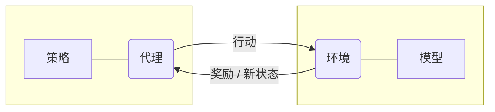
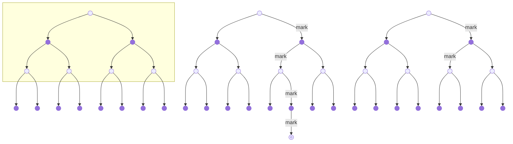

~~希望我能顺利过关~~

<!-- more -->

# 大数定理

大数定律表述了什么？

大量 **独立** 且 **相同** 的 随机样本 的采样平均值会收敛到真实值。

# 马尔可夫属性

什么是马尔可夫性质？

下一个状态只跟当前状态有关，与之前的状态无关。

# RL 元素

强化学习任务的主要元素是什么？绘制示意图来说明。

# RL 类型

什么是：评估性反馈，指示性反馈，非关联任务，关联任务？

- 评估反馈，只使用获得的奖励来决定行动
- 指示反馈，使用外部信息来决定行动

- 非关联任务，只在一种情况下学习并采取行动
- 关联任务，在多种情况下学习并采取行动

# 网格世界

有如下的网格世界，有一个较近的出口回报为 1，另一个较远的出口回报为 10。底部是回报为 -10 的悬崖。网格世界是随机的，噪声为 0.5，奖励为 0，折扣因子 0.99。有两条路可选，对于一个 Q-Learning 代理，最优策略是什么，为什么？

选择较远的出口，且避免悬崖。

- 高噪声可能导致行动不按期望执行，掉入悬崖。
- 高折扣因子导致未来，如终点，的回报很重要。

# 策略迭代

什么是广义策略迭代？

策略评估与策略改进交替进行的一种方法，不是某个特定算法，值迭代算法是一个实例。

# 困境

探索与利用的困境是什么？

很难平衡探索与利用的比率，无法同时追求两者

# 算法对比

比较 DP, MC, TD，每种方法的更新规则是什么？画出它们的备份图。

| DP                 | MC                         | TD                 |
| ------------------ | -------------------------- | ------------------ |
| 需要环境模型       | 不需要环境模型             | 不需要环境模型     |
| 使用自举           | 不使用自举                 | 使用自举           |
| 基于其他估值来更新 | 基于回合结束后的结果来更新 | 基于其他估值来更新 |
| 期望更新           | 样本更新                   | 样本更新           |

# E 贪婪

在有四个动作且 E=0.8 的 epsilon-greedy 策略中，如果已知只有一个贪婪动作，那么选中它的概率是多少？

- 0.2 选中贪婪动作
- 0.8 选中随机动作
  其中 0.25 的概率选中贪婪动作

所以，选中贪婪动作的概率是 0.2 + 0.25 * 0.8 = 0.4

# 多情境

你面临一个 3 臂老虎机任务，其真实值随时间步随机变化，动作 1 2 3 的真实值如下：

| 情况 | 1   | 2   | 3   |
| ---- | --- | --- | --- |
| A    | 0.1 | 0.6 | 0.3 |
| B    | 0.9 | 0.5 | 0.4 |
| C    | 0.2 | 0.1 | 0.2 |
| D    | 0.5 | 0.5 | 0.7 |

每种情况发生概率相同，问

1. 如果你无法判断现在是哪种情况，你的最佳期望是多少，应如何行动？
2. 如果你被告知当前的情况，但仍不知道真实值，你的最佳期望是多少，应如何行动？

1. 如果我不知道当前情况，我只能根据经验选择动作，那么
   - 动作 1 的期望值是 (0.1 + 0.9 + 0.2 + 0.5) / 4 = 0.425
   - 动作 2 的期望值是 (0.6 + 0.5 + 0.1 + 0.5) / 4 = 0.425
   - 动作 3 的期望值是 (0.3 + 0.4 + 0.2 + 0.7) / 4 = 0.4
   所以，我应该选择动作 1 或 2，最佳期望是 0.425

2. 如果我知道当前情况，我就可以选择最佳动作，那么
   - 情况 A，我选择动作 2，0.6
   - 情况 B，我选择动作 1，0.9
   - 情况 C，我选择动作 1 或 3，0.2
   - 情况 D，我选择动作 3，0.7
   所以最佳期望为 (0.6 + 0.9 + 0.2 + 0.7) / 4 = 0.6

