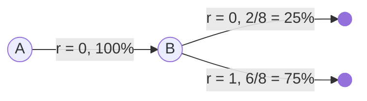

Temporal Difference

<!-- more -->

# 入门

时间差分学习结合了 DP 与 MC 的优点，它不需要等待回合结束，也不需要环境模型。$TD(0)$ 是最简单的 TD 学习方法，它的更新公式为

$$
V(S_t) \leftarrow V(S_t) + \alpha [R_{t+1} + \gamma V(S_{t+1}) - V(S_t)]
$$

其中：

- $V(S_t)$：当前状态的估值
- $R_{t+1}$：即时奖励
- $\alpha$：学习率
- $\gamma$：折扣因子
- $R_{t+1} + \gamma V(S_{t+1})$：TD 目标，对未来回报的估计

在过程中根据新信息动态调整预测的方式，是 TD 的核心思想，例如：你每天开车从学校回家，假设出发的时候预测需要 30 分钟，但是由于路上发现下雨，你调整预测为 40 分钟，但后来你发现路上没有什么车，所以调整为 35 分钟，但快到家的时候堵车了，最终花了 45 分钟到家。

我们可以使用 Batch Updating 的方式，计算 TD(0) 但不立即更新估值，而是等一批次结束后统一更新，这样可以减少噪声，提高稳定性。在有限 MDP 中，使用小学习率，TD(0) 可以保证收敛。相比于 MD，虽然也会收敛，但是 TD 与 MD 会收敛到不同的解，并且 TD 更快，解更好。

## 预测示例

在一个未知的马尔可夫奖励过程（去掉 action 的 MDP）中，我们观察到以下八个回合：

| Episode | 状态序列      |
| ------- | ------------- |
| 1       | A → 0 → B → 0 |
| 2       | B → 1         |
| 3       | B → 1         |
| 4       | B → 1         |
| 5       | B → 0         |
| 6       | B → 1         |
| 7       | B → 1         |
| 8       | B → 1         |

根据数据，你认为最优的预测是什么？即 $V(A)$ 和 $V(B)$ 的最佳值是多少？

要解决这道题，首先要理解 0 和 1 代表奖励，如回合 2，B 状态的奖励是 1。

我们可以简单的统计然后画出上述的状态转移图，然后计算 $V(A)$ 和 $V(B)$ 的值：

如果使用 TD(0)，则 B 终止时的奖励分布为：

$$
V(B) = 0.25 \times 0 + 0.75 \times 1 = \frac{3}{4}
$$

然后我们使用公式反推 $V(A)$：

$$
V(A) = R + \gamma V(B) = 0 + 1 \times \frac{3}{4} = \frac{3}{4}
$$

如果使用 MC，那么它是基于完整回合计算平均回报，则 $V(B) = 0.75$。在观察到的所有回合中，A 的奖励都是 0，所以 $V(A) = 0$。

# Sarsa

TD 更适用于在线学习，Sarsa 在策略内部进行学习 (On-Policy)，它的名字来源于它的更新方式：

$$
(S_t, A_t, R_{t+1}, S_{t+1}, A_{t+1})
$$

更新公式为：

$$
Q(S_t, A_t) \leftarrow Q(S_t, A_t) + \alpha [R_{t+1} + \gamma Q(S_{t+1}, A_{t+1}) - Q(S_t, A_t)]
$$

我们可以发现它与 T(0) 公式相似，只不过是从状态估值变成了动作估值。

## 有风网格世界

Windy Gridworld 是一个带有随机干扰的网格世界，用于研究 on-policy 算法。它在某些列存在风力，会让代理的垂直位置，根据风力大小发生变化。一般来说，我们需要训练代理在风的干扰下找到最短路径。此任务对于 MC 方法来说很困难，因为它需要完整的回合，而有风网格可能会让代理一直停留在某个位置，导致回合无法结束。而 TD 方法可以有效的学习。

# Q-Learning

除了 On-Policy 的 Sarsa，还有 Off-Policy 的 Q-Learning，它的更新公式为：

$$
Q(S_t, A_t) \leftarrow Q(S_t, A_t) + \alpha [R_{t+1} + \gamma \max_a Q(S_{t+1}, a) - Q(S_t, A_t)]
$$

可以观察到它与 Sarsa 的区别在于，它使用了 $\max_a Q(S_{t+1}, a)$，即在下一个状态选择最大 Q 值的动作对应的值，而不是使用当前策略选择的动作。它始终关注在未来可能采取的最优动作，而不依赖于当前的行为策略。

它在特定条件下可以收敛到最优 Q 值：每个 State-Action 被充分探索，学习率随着时间推移逐步减少但不为零，折扣因子保证在有限步数内对未来奖励有足够的重视。
