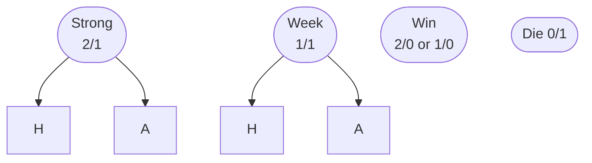
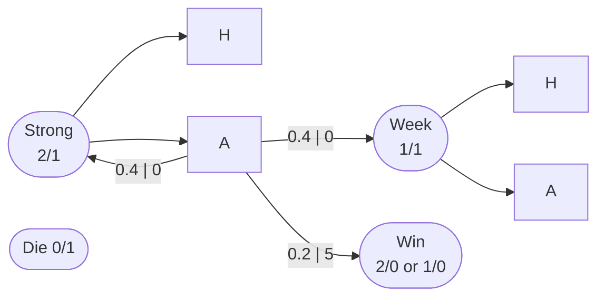
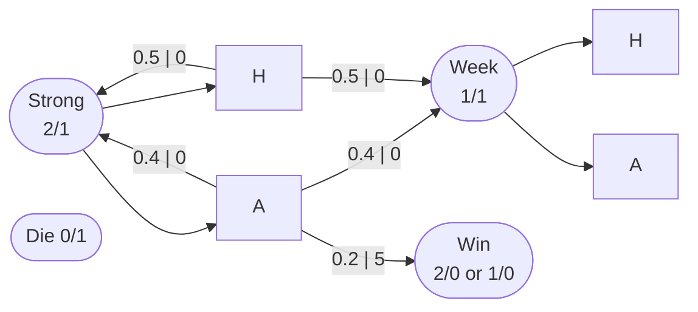
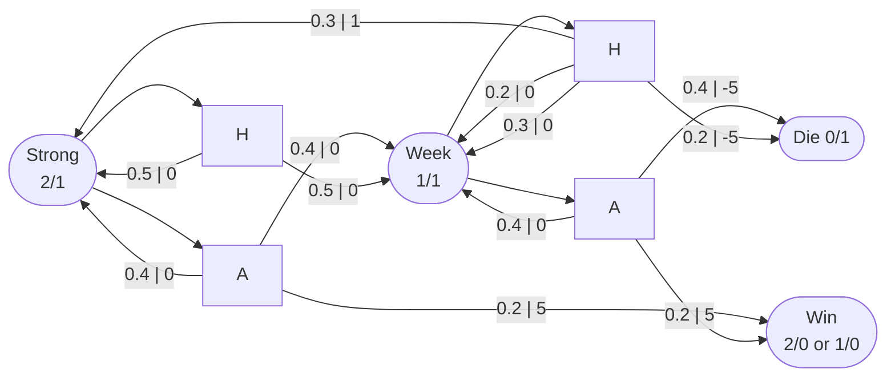

Markov Decision Processes
~~流感让我断更一周~~

<!-- more -->

# 基础概念

马尔可夫决策过程有点像自动机。简而言之，它：在某个状态下，选择一个动作，获得某种奖励，进入下一个状态。

- 状态（State）：$S$，环境状态，如棋盘上的位置，角色血量
- 动作（Action）：$A$，代理可选的动作，如走一步，攻击
- 奖励（Reward）：$R$，反馈，如吃到食物，受到伤害
- 转移概率（Transition Probability）：$P$，状态转移概率，如可能的下一步

决策是一个不断重复的过程，每次做出选择都会影响未来的状态和奖励。其本质是代理（Agent）与环境（Environment）之间的交互：

1. Agent 在状态 $S_t$ 选择动作 $A_t$
2. Environment 返回奖励 $R_{t+1}$ 和新状态 $S_{t+1}$
3. Agent 根据奖励和新状态更新策略
4. 重复

整个过程形成一个轨迹（Trajectory）$S_0, A_0, R_1, S_1, A_1, R_2, S_2, \cdots$，我们可以发现它的核心是“状态如何变化”，我们用

# 转移概率

（Transition Probability）来描述这个过程：

$$
p(s', r | s, a) \doteq Pr\{S_t = s', R_t = r | S_{t-1} = s, A_{t-1} = a\}
$$

其中：

- $s, s'$ 是状态
- $a$ 是动作
- $r$ 是奖励

意思是在状态 $s$ 下，选择动作 $a$，进入状态 $s'$，获得奖励 $r$ 的概率

且 $\sum_{s'} \sum_r P(s', r | s, a) = 1$ 也就是说一定会转移到某个状态并获得某个奖励，不会出现转移到虚空，或者没有奖励的情况，且所有可能的状态和奖励的概率和为 1。

如果状态，动作，奖励是有限个数的，就叫 Finite MDP，我们能够精确计算出最优策略。

此公式还有其他形式：

## 状态转移概率

$$
p(s' | s, a) \doteq Pr\{S_t = s' | S_{t-1} = s, A_{t-1} = a\} = \sum_r p(s', r | s, a)
$$

它表示在状态 $s$ 下，选择动作 $a$，进入状态 $s'$ 的概率。由于状态转移可能伴随不同奖励，所以需要对所有可能的奖励求和。

## 期望即时奖励

$$
r(s, a) \doteq E[R_t | S_{t-1} = s, A_{t-1} = a] = \sum_r r \sum_{s'} p(s', r | s, a)
$$

它表示在状态 $s$ 下，选择动作 $a$，期望获得的奖励 $R_t$。每种情况都有不同的概率和奖励，所以需要对所有可能的状态和奖励求和，以计算平均期望奖励。

## 期望奖励

$$
r(s, a, s') \doteq E[R_t | S_{t-1} = s, A_{t-1} = a, S_t = s'] = \sum_r r \frac{p(s', r | s, a)}{p(s' | s, a)}
$$

这里是在已经知道从 $s$ 执行 $a$ 后，转移到 $s'$ 的情况下，计算期望奖励。通过对所有可能的奖励加权求和，归一化到特定的状态转移概率 $s \to s'$。

## 确定与随机

如果一个系统是 Deterministic 的，那么在给定 $s$ 和 $a$ 后，$s'$ 是确定的，即 $p(s' | s, a) = 1$，每次执行相同的动作，结果都会一样，如棋类游戏。

如果是 Stochastic 的，那么 $p(s' | s, a)$ 是一个概率分布，且 $\sum_{s'} p(s' | s, a) = 1$，表示执行后可能转移到不同状态，如掷骰子，环境有随机变化等。

任何代理无法改变的事物都是环境的一部分，边界代表着代理能够影响的事物的范围极限。

## 例子

假设有环境，你当前处于 C：

| x    | 10, A | x    |
| ---- | ----- | ---- |
| 0, B | 0, C  | 0, D |
| x    | 0, E  | x    |

- State Space: $S = [A, B, C, D, E]$
- Action Space: $A = [Up, Down, Left, Right]$

### 确定性转移

代理在 C 选择 Up，进入 A 的概率是 1，奖励是 10，公式表示为

$$
p(A | C, Up) = 1
$$

奖励表述为

$$
r(C, Up) = 10 \times p(A, 10 | C, Up) = 10
$$

### 随机转移

设代理有 0.8 的概率向上移动成功，0.1 的概率被环境带到其他位置。

$$
p(A | C, Up) = 0.8, p(B | C, Up) = 0.1, p(C | C, Up) = 0.1
$$

奖励计算为：

$$
r(C, Up) = 10 \times p(A, 10 | C, Up) + 0 \times p(B, 0 | C, Up) + 0 \times p(C, 0 | C, Up) = 8
$$

# Exercise: Transition Graph

你正在玩一个回合制战斗游戏：

- 你的初始 HP = 2
- 敌人的初始 HP = 1
- 你的动作有 Attack 和 Heal
- 攻击：有 0.2 的几率击杀敌人，获得 5 奖励，其余情况无事发生
- 治疗：有 0.6 的几率回复 1 HP（最大 HP 2），获得 1 奖励，其余情况无事发生
- 你执行动作后，敌人有 0.5 的几率攻击你，造成 1 伤害
- 如果你 HP = 0，游戏结束，获得 -5 奖励
- 如果敌人 HP = 0，游戏结束，获得 5 奖励

我们能够列出所有的可能状态：

你现在在 Strong，假设你选择了攻击，那么你有 0.2 的概率杀死敌人获得奖励。但还有 0.8 的概率无事发生，这就轮到敌人的回合，它有 0.5 的概率让你受到伤害，则：

你现在在 Strong，假设你选择了治疗，但是你满血，所以无论回血是否发生，都无事发生，轮到敌人的回合，它有 0.5 的概率让你受到伤害，则：

其他情况以此类推，最终得到：

在 Week 时治疗，有 0.6 概率成功，随后有 0.5 的概率再被攻击，所以是 0.3 的概率回到 Strong。

# 目标与奖励

代理的目标是最大化累积奖励的期望值。

$$
G_t \doteq R_{t+1} + \gamma R_{t+2} + \gamma^2 R_{t+3} + \cdots + \gamma^{T-t-1} R_T = \sum_{k=0}^{\infty} \gamma^k R_{t+k+1}
$$

其中：

- $G_t$ 是从 $t$ 时刻开始的累积奖励
- $R_t$ 是 $t$ 时刻的奖励

任务类型

- Episodic Task：上面的 t 是有限的，任务有明确的终止状态，如游戏
- Continuing Task：t 是无限的，任务没有明确的终止状态，如生存，股票

折扣回报（Discounted Return）：

由于在持续任务中，回报可能是无限的，难以计算，且在现实世界中，未来的奖励通常不如当前奖励重要，因此要给未来奖励打折，所以引入折扣因子 $0 \leq \gamma \leq 1$，来减少未来奖励的影响。

- $\gamma \rightarrow 0$：关注短期的奖励
- $\gamma \rightarrow 1$：关注长期的奖励

由于折扣回报涉及多个时间步，所以可以使用递归形式：

$$
G_t \doteq R_{t+1} + \gamma G_{t+1}
$$

表明当前的回报由 当前奖励 和 未来回报 组成。我们约定 $R_{T+1}$ 代表在 $t$ 时采取动作的奖励。

当 $R_t = 1$ 且 $\gamma < 1$ 时，有：

$$
G_t = \frac{1}{1 - \gamma}
$$

# 马尔可夫性质

Markov Property 就一句话，下一个状态只依赖于当前状态，与之前的状态无关。

练习：给定 $\gamma = 0.5$，奖励序列如下：

- $R_1 = -1$
- $R_2 = 2$
- $R_3 = 6$
- $R_4 = 3$
- $R_5 = 2$

目标是计算从每个时间步 $t$ 开始的折扣回报 $G_t$。

解：

在 MDP 中，终止状态的回报通常为 0，因为不会再有新的状态了，所以有

$$
G_5 = 0
$$

我们从最后一步开始，使用折扣回报公式，逐步向前计算：

$$
G_t = R_{t+1} + \gamma G_{t+1}
$$

| t   | $R_t$      | $G_t$                         |
| --- | ---------- | ----------------------------- |
| 5   | -          | $G_5 = 0$                     |
| 4   | $R_5 = 2$  | $G_4 = 2 + 0.5 \times 0 = 2$  |
| 3   | $R_4 = 3$  | $G_3 = 3 + 0.5 \times 2 = 4$  |
| 2   | $R_3 = 6$  | $G_2 = 6 + 0.5 \times 4 = 8$  |
| 1   | $R_2 = 2$  | $G_1 = 2 + 0.5 \times 8 = 6$  |
| 0   | $R_1 = -1$ | $G_0 = -1 + 0.5 \times 6 = 2$ |

# 吸收状态

有限与无限任务需要一个共同的表示方式，所以我们为 Episodic Task 引入了吸收状态（Absorbing State）。当任务到达 $T$ 时，不再设为终止状态，而是吸收状态，它不会再产生奖励。我们可以重新定义折扣回报：

$$
G_t \doteq \sum_{k=t+1}^{T} \gamma^{k-t-1} R_k
$$

- $G_t$ 是从 $t$ 时刻开始的累积奖励
- $R_k$ 是 $k$ 时刻的奖励
- $T$ 是任务结束的时间步，也可以是无限的
- $T = \infty$ 与 $\gamma = 1$ 不能同时存在，否则回报无限

# 策略与价值函数

代理用于在环境中做出决定的规则成为策略（Policy）$\pi$，将状态映射到动作：

$$
\pi(a|s) = P(A_t = a | S_t = s)
$$

这表示代理在状态 $s$ 下选择动作 $a$ 的概率。策略可以是确定性（Deterministic）的，即 $\pi(s) = a$，在某个状态下始终采取同一个动作。也可以是随机性（Stochastic）的，即上述公式。在 RL 中，我们的目标是找到最优策略 $\pi^*$，使得在任何状态下，都能获得最大的累积奖励。

Value Function 用于衡量 State-Action Pair 的好坏，即代理在该状态下应期望得到多少奖励。

## Action-value 函数

动作价值函数表示在策略 $\pi$ 下，从状态 $s$ 开始，选择动作 $a$ 后，未来能够获得的期望折扣回报：

$$
q_{\pi}(s, a) \doteq E_{\pi}[G_t | S_t = s, A_t = a] = E_{\pi}[\sum_{k=0}^{\infty} \gamma^k R_{t+k+1} | S_t = s, A_t = a]
$$

这个函数对于动作选择很重要，它直接告诉我们某个动作的价值。人类难以直观估计 Q 值，因为其涉及长期回报计算。

我们可以用递归（Bellman）的方式表示：

$$
q_{\pi}(s, a) = E_{\pi}[R_{t+1} + \gamma q_{\pi}(S_{t+1}, A_{t+1}) | S_t = s, A_t = a]
$$

## State-value 函数

状态价值函数表示在策略 $\pi$ 下，从状态 $s$ 开始，未来能够获得的期望折扣回报：

$$
v_{\pi}(s) \doteq E_{\pi}[G_t | S_t = s] = E_{\pi}[\sum_{k=0}^{\infty} \gamma^k R_{t+k+1} | S_t = s]
$$

> 折扣是折扣因子导致的

我们可以用递归（Bellman）的方式表示：

$$
v_{\pi}(s) = E_{\pi}[R_{t+1} + \gamma v_{\pi}(S_{t+1}) | S_t = s]
$$

$V_{\pi}(s)$ 是在该状态下所有可能的动作 $Q(s, a)$ 的加权和：

$$
v_{\pi}(s) = \sum_{a} \pi(a|s) q_{\pi}(s, a)
$$

这意味着某个状态的价值，是在该状态下按策略选择不同动作的期望值。它衡量的是在该状态下，按照策略平均能得到多少奖励。

## 例：值迭代

| x   | 1   | 2   | 3   |
| --- | --- | --- | --- |
| 4   | 5   | 6   | 7   |
| 8   | 9   | 10  | 11  |
| 12  | 13  | 14  | x   |

- Action Space: $A = [Up, Down, Left, Right]$
- 策略：每个动作选择概率相等 $\pi(a|s) = 0.25$
- 每走一步都会有 $R = -1$ 的奖励，终点设置为 0。
- 环境为确定性环境，即 $p(s' | s, a) = 1$
- $\gamma = 1$

请计算每个状态的价值函数 $V(s)$，进行策略评估。

解：

值迭代使用贝尔曼方程来迭代：

$$
v_{\pi}(s) = \sum_{a} \pi(a|s) \sum_{s', r} p(s', r | s, a) [r + \gamma v_{\pi}(s')]
$$

$k = 0, V_0(s) = 0$

| 0   | 0   | 0   | 0   |
| --- | --- | --- | --- |
| 0   | 0   | 0   | 0   |
| 0   | 0   | 0   | 0   |
| 0   | 0   | 0   | 0   |

### $k = 1$

用 $s = 1$ 为例，分析概率：

- Up: $p(1, -1 | 1, Up) = 1$
- Down: $p(5, -1 | 1, Down) = 1$
- Left: $p(0, -1 | 1, Left) = 1$
- Right: $p(2, -1 | 1, Right) = 1$
- 其余情况为 0，如 $p(6, -1 | 1, Down) = 0$ 因为不可能直接从 1 走到 6

所以

$$
v_{\pi}(1) = \sum_{4} 0.25 \sum_{s', r} p(s', r | 1, a) [r + \gamma v_{\pi}(s')] = \\
0.25 \times 1 \times [-1 + 1 \times 0] + \\
0.25 \times 1 \times [-1 + 1 \times 0] + \\
0.25 \times 1 \times [-1 + 1 \times 0] + \\
0.25 \times 1 \times [-1 + 1 \times 0] = \\
4 \times 0.25 \times -1 = -1
$$

其他点也是同样的情况，有

| 0   | -1  | -1  | -1  |
| --- | --- | --- | --- |
| -1  | -1  | -1  | -1  |
| -1  | -1  | -1  | -1  |
| -1  | -1  | -1  | 0   |

### $k = 2$

用 $s = 1$ 为例：

$$
v_{\pi}(1) = \sum_{4} 0.25 \sum_{s', r} p(s', r | 1, a) [r + \gamma v_{\pi}(s')] = \\
0.25 \times 1 \times [-1 + 1 \times 0] + \\
0.25 \times 1 \times [-1 + 1 \times -1] + \\
0.25 \times 1 \times [-1 + 1 \times -1] + \\
0.25 \times 1 \times [-1 + 1 \times -1] = \\
3 \times 0.25 \times -2 + 1 \times 0.25 \times -1 = -1.75
$$

其他点也是同样的算法：

$$
v_{\pi}(6) = \sum_{4} 0.25 \sum_{s', r} p(s', r | 6, a) [r + \gamma v_{\pi}(s')] = \\
0.25 \times 1 \times [-1 + 1 \times -1] + \\
0.25 \times 1 \times [-1 + 1 \times -1] + \\
0.25 \times 1 \times [-1 + 1 \times -1] + \\
0.25 \times 1 \times [-1 + 1 \times -1] = \\
4 \times 0.25 \times -2 = -2
$$

得到

| 0     | -1.75 | -2    | -2    |
| ----- | ----- | ----- | ----- |
| -1.75 | -2    | -2    | -2    |
| -2    | -2    | -2    | -1.75 |
| -2    | -2    | -1.75 | 0     |

然后可以无限向后迭代，直到达到某个收敛值。
